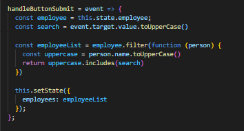
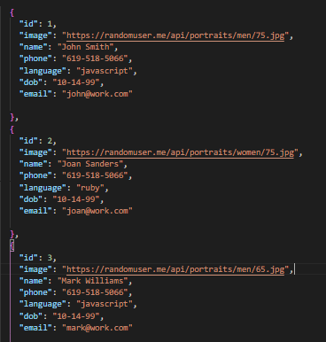

# Onsite Directory

 

This Onsite Directory is a model for a company employee directory. It was built with React.JS and uses component states to organize data.

## Table of Contents

* [Tech Used](#tech_used)
* [Usage](#usage)
* [Features](#features)
* [Deployed_Link](#deployed_link)
* [Author](#author)
* [License](#license)

----

## Tech Used

* [HTML](https://developer.mozilla.org/en-US/docs/Web/HTML)
* [Javascript](https://developer.mozilla.org/en-US/docs/Web/JavaScript)
* [React](https://reactjs.org/)
* [NPM](https://www.npmjs.com/)
* [Express](https://expressjs.com/)
* [nodeJS](https://nodejs.org/en/)

## Usage
 
 The Onsite Directory has variable search paramenters. Users can select the Name, Email, or Language header tabs to change the sorting order of the directory or type a name into the search bar to search for a particular employee.

## Features

- Handle click event listeners change the state and allow sorting options. 

  

- HandleButtonClick function sorts employees, brings matching employees to the top of the list..

  

- Database of employees stored in json format for easy retrieval/input.

  

## Deployed Link

* [See Live Site](https://pacific-journey-56718.herokuapp.com/)

---

## Author

**AJ Huff** 

- [Portfolio Site](https://stark-mesa-37630.herokuapp.com/)
- [Github](https://github.com/ajhuff7)
- [LinkedIn](https://www.linkedin.com/in/aj-huff-7696b14b/)

## License

 